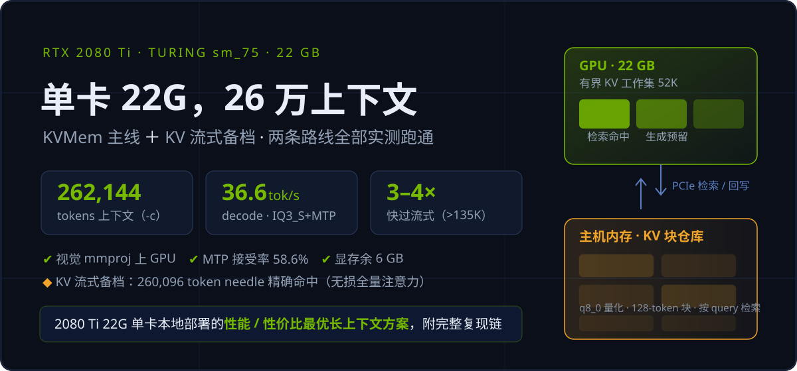

<div align="center">
  
  <p>
    
    
    
    
    
    
  </p>
</div>

# RTX 2080 Ti 22G（sm_75）单卡长上下文工场

> **一张 2018 年的 22G 老卡，跑出 26 万 token 上下文 + 36.6 tok/s 解码。**
> 本仓库把 [KVMem](https://github.com/kvmem/kvmem-llama.cpp)（检索式长上下文）移植到 Turing / sm_75 / Windows 并公开全部实测——这是**2080 Ti 22G 单卡本地部署中，兼顾上下文长度、解码速度与模型能力的性能 / 性价比最优方案**，且每一项数字都可复现。

---

## 🏆 实测成绩（全部来自本机 RTX 2080 Ti 22G，可复现）

**主线 · KVMem**（Qwen3.8-27B-GSQ-RCO-IQ3_S + MTP + 视觉，262K 上下文，q8_0 KV）：

| 指标 | 本机 2080 Ti 22G | 上游作者 RTX 5060 Ti 16G |
|---|---|---|
| **decode** | **36.6 tok/s** ⚡ | 31.7 tok/s |
| MTP 接受率 | 58.6% / 61.6%（n_max=3 + ReplaySSM） | — |
| 上下文 | 262,144 tokens | 256K |
| 视觉 | mmproj BF16 上 GPU，位置/颜色/形状全对 | ✅ |
| 显存占用 | 16,552 / 22,528 MiB（**余 ~6 GB**） | 满 |
| 质量验货 | 算术/代码/中文/逻辑/创作全对，无 IQ3 乱码 | — |

**备档 · KV 流式**（无损全量注意力）：260,096 token needle-in-a-haystack **精确命中**——详见 [kv-streaming/](kv-streaming/README.md)。

> 官方 rc3 预编译仅实测过 RTX 5060 Ti（sm_120），**Turing 的公开实测数据本仓是独一份**。decode 受显存带宽约束（2080 Ti 616 GB/s > 5060 Ti 448 GB/s），带宽优势直接兑现为速度优势。

---

## 🧭 两条路线，怎么选

| | **KVMem（主线 · 检索式）** | KV 流式（备档 · 无损） |
|---|---|---|
| 原理 | 已完成 KV 块存**主机内存**，每轮按 query **检索**相关块进 GPU 工作集，注意力只看工作集 | KV 后备存储放**系统内存**，显存留常驻池，按需流式搬取，注意力看**全部历史** |
| 26 万上下文 decode | **恒定 ~36.6 tok/s** | 常驻区内 30–42 tok/s，**越过 135K 后 ~9.6 tok/s** |
| 注意力保真 | 检索近似（benchmark 级 near-lossless） | **无损** |
| 甜点场景 | 日常 agent 长对话、多轮工具任务（检索命中率最高） | 全文精确综合：总结全文、对比散落 200K 各处的事实 |
| 一句话 | **把"越长越慢"换成"检索可能漏块"** | **精确，但越长越慢** |

两套方案共用同一张卡、同一批模型，**按任务切换，不必二选一**。

---

## 🚀 快速开始（Windows，四条命令）

**环境**：Windows 10/11 · VS 2022/18 (MSVC) · CUDA Toolkit **13.2 Update 2**（免管理员 redist 安装法见[移植报告](kvmem/docs/kvmem-windows-port-zh.md)）· Git

```bat
cd kvmem

:: 1. 拉取上游源码（v0.16.0-rc1 基线 + llama.cpp b81c99b）并打上本仓 sm_75/Windows 补丁
prepare-source.bat

:: 2. 编译（sm_75 显式目标 + FA_ALL_QUANTS）
cd kvmem-src && build-windows-sm75.bat

:: 3. 启动生产配方（IQ3_S + MTP + 视觉 + 262K + q8_0 KV）
::    完整启动参数见 kvmem\docs\kvmem-windows-port-zh.md 第三节

:: 4. 跑质量/性能验证
python ..\kvmem\tools\needle-test.py --port 18200 --chunks 30 --chunk-tokens 8000
```

只想**免编译试玩**：下载官方 [v0.16.0-rc3 Windows 预编译](https://github.com/kvmem/kvmem-llama.cpp/releases/tag/v0.16.0-rc3)（RTX 20 系编译目标已覆盖），或 [prism.3 实验版](https://github.com/kvmem/kvmem-llama.cpp/releases/tag/v0.16.0-rc3-prism.3)（Bonsai 2 27B，解压即跑）。

<details>
<summary><b>KV 流式备档方案的三步开始</b>（点击展开）</summary>

```bat
cd kv-streaming
scripts\prepare-source.bat        :: 拉源码 + 打 sm_75 补丁
scripts\build-sm75.bat            :: 为 sm_75 编译
scripts\package-sm75.bat          :: 打包服务器 + DLL
```

实测数据、262K 启动配方与踩坑手册见 [kv-streaming/README.md](kv-streaming/README.md)。

</details>

---

## ⚙️ 为什么这是 2080 Ti 的最优解（机制，不是口号）

- **检索式 > 流式的部分**：KVMem 把长上下文的注意力计算量压成**常数**（工作集 52K），越过 13 万 token 后速度不掉——流式方案在同区间只剩 9.6 tok/s，**本机实测 3–4 倍**。
- **Turing 移植 > 上游原生的部分**：上游从未实测 sm_75。本仓补齐了 Windows/MSVC 构建、`kvmem_win_compat.h` 兼容层、CMake 修正与 sm_75 验证——并提供**一个提交号锁定的完整复现链**（`prepare-source.bat` → 编译 → 验证脚本）。
- **22G > 16G 的部分**：上游配方按 16G 卡挤预算，本机实测留有 6 GB 余量——可以上调 `--kvmem-budget` / `--kvmem-gen-reserve` 换更高检索命中率与更长单回合产出。
- **比 40G 卡贵的方案省的部分**：一张二手 2080 Ti 22G 改装卡的价格远低于 4090/A6000，上下文能力却达到同级。

---

## 📡 上游动态（2026-09-28 调研）

- **v0.16.0-rc3**：Windows 预编译覆盖 RTX 20/30/40/50 编译目标（sm_75 代码在内），官方仅实测 5060 Ti。
- **v0.16.0-rc3-prism.3**：Ternary Bonsai 2 27B 的 RTX 20 系免编译包（CUDA 12.9）。
- **v0.17.0**（tag 已打，release 未发）：会话 NVMe/磁盘缓存、多对话 host KV 常驻、多卡层切分 + MTP、OpenAI Responses API；单回合 `--kvmem-gen-reserve` 上限**尚未修复**。

本仓基线锁定 **13b7a15**（v0.16.0-rc1 + 4 commits，即 36.6 tok/s 实测所用树），升级策略：等 v0.17.0 正式发布后整体重验再跟进。

---

## 📁 仓库结构（一目了然）

```text
2080ti-22G-long-context/
├─ README.md              ← 本文件（中文主文档）
├─ README_EN.md           ← English version
├─ kvmem/                 ★ 主线：KVMem 移植
│  ├─ README.md             复现手册（含基线锁定与配方说明）
│  ├─ prepare-source.bat    一键拉取上游源码 + 打补丁 = 完整源码
│  ├─ build-windows-sm75.bat Windows/sm_75 编译脚本
│  ├─ include/              kvmem_win_compat.h（Windows 兼容层）
│  ├─ patches/              父仓补丁 + llama.cpp 子模块快照补丁
│  ├─ tools/                needle / 多 needle / decode / A-B 测试脚本
│  └─ docs/                 方案评估 + Windows/sm_75 移植验证报告
└─ kv-streaming/          ◇ 备档：adaptive KV streaming（无损路线）
   ├─ README.md / README_EN.md
   ├─ patches/ scripts/ tools/ results/ docs/
   └─ requirements.txt
```

---

## 🧯 诚实的边界

- KVMem 是**检索近似**：全局综合类任务（全文总结、跨段事实对比）可能漏块——这类任务请切到流式备档。
- 单次生成不得超过 `--kvmem-gen-reserve`（IQ3 配方 16384 token，含思考）——上游 v0.17 在修，本机可用显存余量自行上调缓解。
- 实测仅覆盖**一张卡（2080 Ti 22G）、一个模型线（Qwen3.8-27B）**；其他 Turing 卡欢迎提 issue 反馈结果。
- 本仓不分发模型权重、CUDA 运行库，不含任何密钥。

## 📜 许可与致谢

MIT（见 [LICENSE](LICENSE)）。KVMem 实现源自 [kvmem/kvmem-llama.cpp](https://github.com/kvmem/kvmem-llama.cpp)；adaptive KV streaming 实现源自 [RaymondHuang210129/llama.cpp-adaptive-kv-streaming](https://github.com/RaymondHuang210129/llama.cpp-adaptive-kv-streaming)。模型各自许可，本仓仅提供移植补丁、构建脚本与实测数据。

**English:** see [README_EN.md](README_EN.md).

---

*RTX 2080 Ti · sm_75 · Turing · KVMem · 检索式长上下文 · KV 流式 · 22GB 显存 · 262K 上下文 · 本地部署 · Qwen3.8 · MTP 投机解码 · llama.cpp · 单卡推理 · 最佳性价比*
